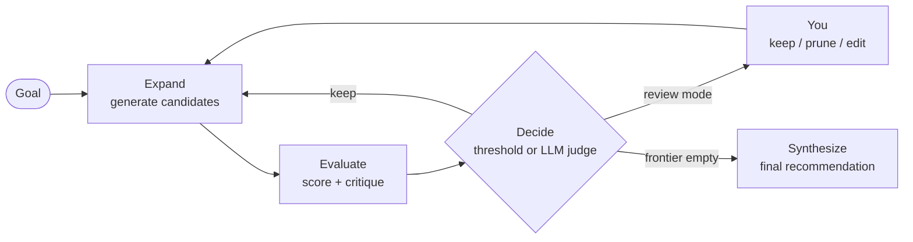

# Kodoku — Decision Graph AI

> **A decision engine, not a chatbot.** Give Kodoku a goal and it grows a
> visible tree of ideas — branching, scoring, and pruning them with LLMs —
> then writes up a recommendation. You stay in the loop at every branch.

[](https://github.com/git-timoh/Decision-Graph-AI-Kodoku-/actions/workflows/ci.yml)
[](LICENSE)
[](https://www.python.org/)

Chat interfaces give you one answer and hide the alternatives. Kodoku runs a
**Tree-of-Thoughts** search instead: your goal becomes a root node, the engine
branches it into candidate ideas, an LLM scores and critiques each one, weak
branches get pruned, strong ones branch again — and you watch the whole graph
grow live, able to overrule any decision before the final synthesis.

Everything runs **on your machine**: one local process, one SQLite file, your
own API keys. No account, no telemetry — the only network traffic is the model
calls you configure.

<!-- TODO: add a screenshot or demo GIF of a session graph here -->

## How it works



Each cycle uses the model role you configured for it — typically a **strong
model to expand** (ideas are where quality matters) and a **cheap model to
evaluate and synthesize**. Every step is journaled as an event, streamed to the
UI over WebSocket, and replayable after the fact.

### Features

- **Live decision graph** — watch nodes appear, get scored, and get pruned in
  real time; click any node for its full content, critique, and score breakdown.
- **Human-in-the-loop** — *autopilot* runs start to finish; *review each
  branch* pauses at every decision so you can keep, prune, or edit candidates
  before the run continues.
- **Two decision modes** — a deterministic score threshold, or an **LLM judge**
  that compares siblings and explains its reasoning (with automatic fallback to
  the threshold if the judge misbehaves).
- **Bring your own models** — one OpenRouter key covers every model, or use
  per-provider keys (OpenAI, Anthropic, DeepSeek, …). Ollama works for fully
  local runs. Per-branch model overrides let different models compete on the
  same goal.
- **Cost control** — live cost tracking on every run, plus an optional USD
  budget cap that stops the run cleanly at a branch boundary.
- **Export & replay** — download a decision memo (Markdown) or the raw session
  (JSON), and scrub back through any session step by step.

## Quick start

### Option 1: Docker (nothing to install)

```bash
docker build -t kodoku .
docker run --rm -p 8000:8000 -v kodoku-data:/data kodoku
```

Open <http://localhost:8000>. The named volume keeps your sessions across
container restarts.

### Option 2: pipx (needs Python 3.12+ and Node 20+ to build the UI)

```bash
python scripts/build.py   # builds the UI and stages it into the package
pipx install ./backend
kodoku                    # starts the server and opens http://localhost:8000
```

`kodoku --help` shows `--host`, `--port`, and `--no-browser`. Data lives in a
`kodoku.db` SQLite file in the directory you launch from.

### First run

1. Open **Settings** (the app will remind you if no key is set).
2. Add an API key. The simplest is one **[OpenRouter](https://openrouter.ai)**
   key — it unlocks every model in the list. Per-provider keys work too, as
   does an **Ollama** base URL (e.g. `http://localhost:11434`) for local models.
3. Click **Test connection** to verify, then **Save**.
4. On the home page: **New session** → describe your goal → **Create** → **Run**.

Try a goal like *"Find the best side-project idea combining AI and music"* with
**Review each branch** enabled to see the human-in-the-loop flow.

## Configuration

Everything lives in-app under **Settings** and is stored in the local database:

| Setting | What it does |
| --- | --- |
| Provider keys | BYOK, stored server-side; only a 4-character hint is ever shown after saving. |
| Ollama base URL | Enables `ollama/*` models for fully local runs. |
| Models per role | `expand` / `evaluate` / `synthesize` — pick from the shortlist or type any LiteLLM-style `provider/model` slug. |

Per session (in the New session dialog): goal, optional per-branch expand-model
overrides, human-review mode, decision mode (threshold vs. LLM judge), and an
optional USD budget cap.

The only environment variable most people need is `DATABASE_URL`:

| Variable | Default | Notes |
| --- | --- | --- |
| `DATABASE_URL` | `sqlite+aiosqlite:///./kodoku.db` | Point at `postgresql+asyncpg://…` to run against Postgres (intended for a future hosted build). |
| `ALLOWED_ORIGINS` | `http://localhost:3000` | CORS, only relevant in two-process dev mode. |
| `LOG_LEVEL` | `INFO` | Backend log verbosity. |

## Development

The packaged app serves a *prebuilt* UI. For development, run backend and
frontend as two processes with hot reload.

**Prereqs:** Python 3.12+, Node 20+.

```bash
# Terminal A — backend on :8000
cd backend
python -m venv .venv
source .venv/bin/activate        # Windows: .\.venv\Scripts\Activate.ps1
pip install -e ".[dev]"
uvicorn kodoku.main:app --reload --port 8000

# Terminal B — frontend on :3000
cd frontend
cp .env.example .env.local       # NEXT_PUBLIC_API_BASE_URL=http://localhost:8000
npm install
npm run dev
```

The backend creates the SQLite schema automatically on first start — no
migration step. (Postgres uses Alembic instead: `docker compose up -d postgres`
then `alembic upgrade head`.)

### Tests & checks

```bash
# Backend
cd backend && pytest && ruff check kodoku tests && mypy kodoku

# Frontend
cd frontend && npm run typecheck && npm run lint && npm run build
```

CI ([`.github/workflows/ci.yml`](.github/workflows/ci.yml)) runs the backend
suite, the frontend build, and a Docker build that smoke-tests the packaged
single-port app.

### Regenerating frontend API types

`frontend/lib/types/contracts.ts` is generated from the backend's OpenAPI
schema. After changing a Pydantic DTO, run the backend, then:

```bash
cd frontend && npm run gen:contracts
```

## Architecture

| Layer | Tech |
| --- | --- |
| Frontend | Next.js 14 (App Router, static export), TypeScript, Tailwind, Zustand, React Flow |
| Backend | FastAPI, SQLAlchemy 2 (async), Pydantic v2 |
| Database | SQLite by default (local-first); PostgreSQL supported via Alembic |
| LLM | LiteLLM — OpenRouter / OpenAI / Anthropic / DeepSeek / Ollama / … |

The engine journals every state change as an **event row** (the durable truth),
then fans it out over WebSocket. Reconnects and the replay mode both just
re-fold the journal, so the UI can always be rebuilt from the database — a
crashed or restarted server picks up cleanly.

```
kodoku/
├── backend/            FastAPI + SQLAlchemy; the kodoku package + CLI
│   └── kodoku/
│       ├── engine/     Tree-of-Thoughts loop: expand / evaluate / decide / synthesize
│       ├── api/        REST endpoints (sessions, run, settings, events, export)
│       ├── ws/         WebSocket fan-out + event journal funnel
│       └── llm/        LiteLLM client factory, per-role model resolution
├── frontend/           Next.js app (built to a static export, served by the backend)
├── scripts/            build.py — stage the UI into the package
├── docs/               architecture notes, specs, plans
├── Dockerfile          multi-stage: build UI → serve UI + API on one port
└── docker-compose.yml  optional Postgres for development
```

## Contributing

Issues and PRs are welcome. Before opening a PR, run the backend and frontend
checks above — CI runs the same set.

## License

[MIT](LICENSE) © 2026 Tim Oh
